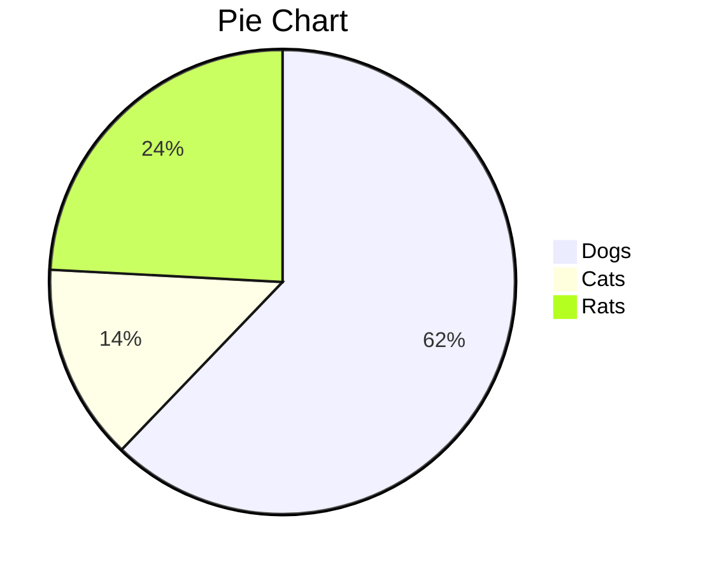

# htmlreport

## 建template
```
curl -u elastic:elastic -X PUT \
 http://127.0.0.1:9200/_template/backup-monitor_template \
 -H 'content-type:application/json' \
 -d '{
   "template": "backup-monitor*",
   "index_patterns": ["backup-monitor*"],
   "settings" : {
      "index" : {
         "number_of_replicas" : 1,
         "number_of_shards" : 3
      }
   },
   "mappings" : {
            "properties": { 
               "backup_project":{"type":"text"},
               "backup_method":{"type":"text"},
               "ip_addr":{"type":"ip"},
               "backup_path":{"type":"text"},
               "backup_status":{"type":"text"},
               "backup_time":{"type":"date"}
            }
   }
}'


```

## 接口测试


请求URL：
http://172.24.126.15:5000/api/backupinfo

请求方式：
POST

参数：
```
{
  "backup_project": "Zabbix 数据库",
  "backup_method": "mysqldump",
  "ip_addr": "172.24.126.15",
  "backup_path": "/data/zabbix.sql",
  "backup_status": "ok",
  "backup_time": "2016-07-14T09:23:38.388Z"
}

```


返回示例

```
{
"status": "ok"
}
```



